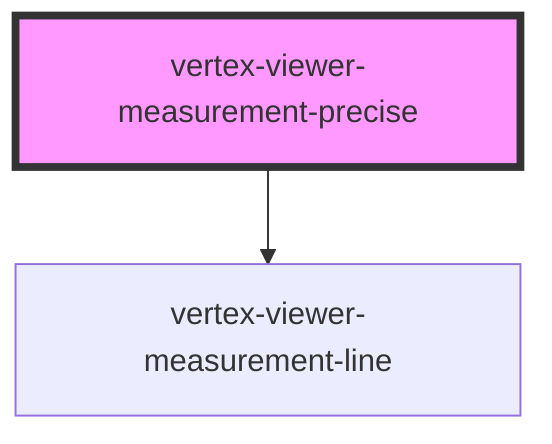

# vertex-viewer-measurement-precise

<!-- Auto Generated Below -->

## Properties

| Property                | Attribute    | Description | Type                                       | Default                           |
| ----------------------- | ------------ | ----------- | ------------------------------------------ | --------------------------------- |
| `config`                | --           |             | `Config \| undefined`                      | `undefined`                       |
| `configEnv`             | `config-env` |             | `"platdev" \| "platprod" \| "platstaging"` | `'platprod'`                      |
| `measurementController` | --           |             | `MeasurementController \| undefined`       | `undefined`                       |
| `measurementModel`      | --           |             | `MeasurementModel`                         | `new MeasurementModel()`          |
| `measurementOverlays`   | --           |             | `MeasurementOverlayManager`                | `new MeasurementOverlayManager()` |
| `viewer`                | --           |             | `HTMLVertexViewerElement \| undefined`     | `undefined`                       |

## CSS Custom Properties

| Name                                        | Description                                       |
| ------------------------------------------- | ------------------------------------------------- |
| `--viewer-measurement-precise-x-axis-color` | A CSS color for overlays representing the X axis. |
| `--viewer-measurement-precise-y-axis-color` | A CSS color for overlays representing the Y axis. |
| `--viewer-measurement-precise-z-axis-color` | A CSS color for overlays representing the Z axis. |

## Dependencies

### Depends on

- [vertex-viewer-measurement-line](../viewer-measurement-line)

### Graph

----------------------------------------------

*Built with [StencilJS](https://stenciljs.com/)*
