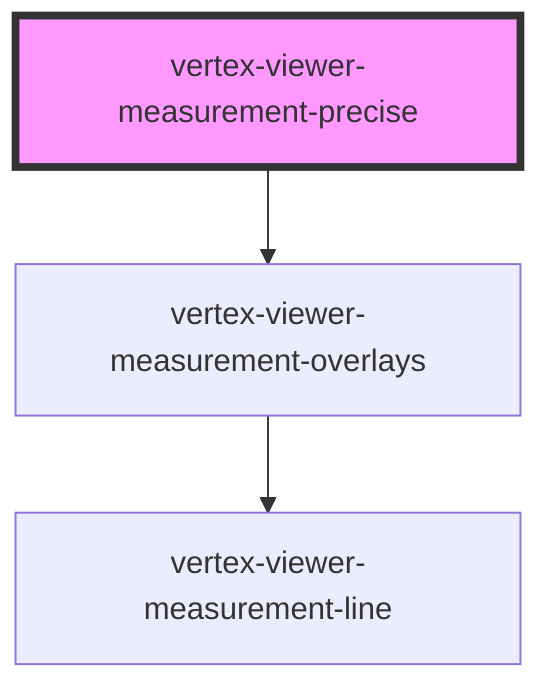

# vertex-viewer-measurement-precise

The `<vertex-viewer-measurement-precise>` is a component that performs precise
measurement for models that have been imported with BREP data. Precise
measurement currently supports measurement of surfaces and will return available
measurement data between multiple surfaces, including:

* Minimum distance
* Planar angle
* Planar distance
* Surface area

**Example:** Performing a measurement and displaying results.

This example shows how to perform a precise measurement and pass its
`MeasurementModel` to a `vertex-viewer-measurement-details` component to display
its results.

_Note:_ The `feature-maps` attribute on the viewer must be set to `final` for
precise measurement to work.

```html
<html>
<body>
  <vertex-viewer id="viewer" src="urn:vertexvis:stream-key:my-key" feature-maps="final">
    <vertex-viewer-measurement-precise
      id="measurement"
    ></vertex-viewer-measurement-precise>

    <vertex-viewer-toolbar placement="bottom-right">
      <vertex-viewer-measurement-details
        id="details"
      ></vertex-viewer-measurement-details>
    </vertex-viewer-toolbar>
  </vertex-viewer>

  <script type="module">
    window.addEventListener('load', () => main());

    async function main() {
      const measurement = document.getElementById('measurement');
      const details = document.getElementById('details');

      // Set the detail's measurement model to display measurement results.
      details.measurementModel = measurement.measurementModel;
    }
  </script>
</body>
</html>
```

<!-- Auto Generated Below -->


## Properties

| Property                | Attribute    | Description                                                                                                                      | Type                                       | Default                           |
| ----------------------- | ------------ | -------------------------------------------------------------------------------------------------------------------------------- | ------------------------------------------ | --------------------------------- |
| `config`                | `config`     | An optional configuration to setup network configuration of measurement endpoints.                                               | `Config \| string \| undefined`            | `undefined`                       |
| `configEnv`             | `config-env` | The environment that will be used to request measurement results.                                                                | `"platdev" \| "platprod" \| "platstaging"` | `'platprod'`                      |
| `measurementController` | --           | The controller that is responsible for performing measurements and updating the model.                                           | `MeasurementController \| undefined`       | `undefined`                       |
| `measurementModel`      | --           | The model that contains the entities and outcomes from performing precise measurements.                                          | `MeasurementModel`                         | `new MeasurementModel()`          |
| `measurementOverlays`   | --           | The manager that is responsible for measurement overlays to present by this component.                                           | `MeasurementOverlayManager`                | `new MeasurementOverlayManager()` |
| `viewer`                | --           | The viewer that this component is bound to. This is automatically assigned if added to the light-dom of a parent viewer element. | `HTMLVertexViewerElement \| undefined`     | `undefined`                       |


## Dependencies

### Depends on

- [vertex-viewer-measurement-overlays](../viewer-measurement-overlays)

### Graph


----------------------------------------------

*Built with [StencilJS](https://stenciljs.com/)*
