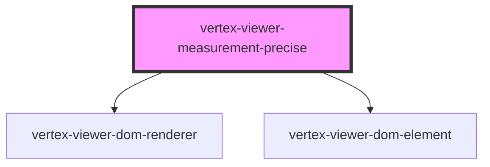

# vertex-viewer-measurement-precise

<!-- Auto Generated Below -->

## Properties

| Property                | Attribute    | Description | Type                                       | Default                  |
| ----------------------- | ------------ | ----------- | ------------------------------------------ | ------------------------ |
| `config`                | --           |             | `Config \| undefined`                      | `undefined`              |
| `configEnv`             | `config-env` |             | `"platdev" \| "platprod" \| "platstaging"` | `'platprod'`             |
| `measurementController` | --           |             | `MeasurementController \| undefined`       | `undefined`              |
| `measurementModel`      | --           |             | `MeasurementModel`                         | `new MeasurementModel()` |
| `viewer`                | --           |             | `HTMLVertexViewerElement \| undefined`     | `undefined`              |

## Dependencies

### Depends on

- [vertex-viewer-dom-renderer](../viewer-dom-renderer)
- [vertex-viewer-dom-element](../viewer-dom-element)

### Graph

----------------------------------------------

*Built with [StencilJS](https://stenciljs.com/)*
