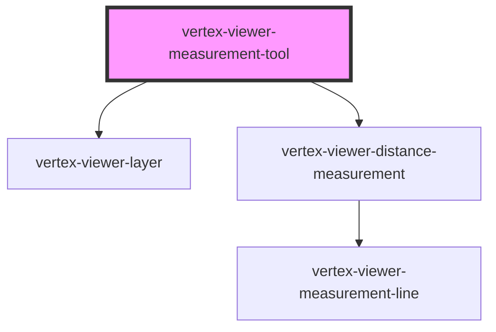

# vertex-viewer-measurement-tool

<!-- Auto Generated Below -->

## Properties

| Property             | Attribute              | Description                                                                                                                                                                                                                                                                       | Type                                                                          | Default         |
| -------------------- | ---------------------- | --------------------------------------------------------------------------------------------------------------------------------------------------------------------------------------------------------------------------------------------------------------------------------- | ----------------------------------------------------------------------------- | --------------- |
| `disabled`           | `disabled`             | Disables measurements.  This property will automatically be set when a child of a `<vertex-viewer-measurements>` element.                                                                                                                                                         | `boolean`                                                                     | `false`         |
| `distanceTemplateId` | `distance-template-id` | An ID to an HTML template that describes the HTML content to use for distance measurements. It's expected that the template contains a `<vertex-viewer-distance-measurement>`.  This property will automatically be set when a child of a `<vertex-viewer-measurements>` element. | `string \| undefined`                                                         | `undefined`     |
| `fractionalDigits`   | `fractional-digits`    | The number of fractional digits to display measurements in.                                                                                                                                                                                                                       | `number`                                                                      | `2`             |
| `isMeasuring`        | `is-measuring`         | A property that indicates if the user is performing a measurement.                                                                                                                                                                                                                | `boolean`                                                                     | `false`         |
| `tool`               | `tool`                 | The type of measurement.  This property will automatically be set when a child of a `<vertex-viewer-measurements>` element.                                                                                                                                                       | `"distance"`                                                                  | `'distance'`    |
| `units`              | `units`                | The unit type to display measurements in.                                                                                                                                                                                                                                         | `"centimeters" \| "feet" \| "inches" \| "meters" \| "millimeters" \| "yards"` | `'millimeters'` |
| `viewer`             | --                     | The viewer to connect to measurements.  This property will automatically be set when a child of a `<vertex-viewer-measurements>` or `<vertex-viewer>` element.                                                                                                                    | `HTMLVertexViewerElement \| undefined`                                        | `undefined`     |

## Events

| Event          | Description                                                             | Type                               |
| -------------- | ----------------------------------------------------------------------- | ---------------------------------- |
| `measureBegin` | An event that is dispatched when a user begins a new measurement.       | `CustomEvent<void>`                |
| `measureEnd`   | An event that is dispatched when a user has finished their measurement. | `CustomEvent<DistanceMeasurement>` |

## Dependencies

### Depends on

- [vertex-viewer-layer](../viewer-layer)
- [vertex-viewer-distance-measurement](../viewer-distance-measurement)

### Graph

----------------------------------------------

*Built with [StencilJS](https://stenciljs.com/)*
