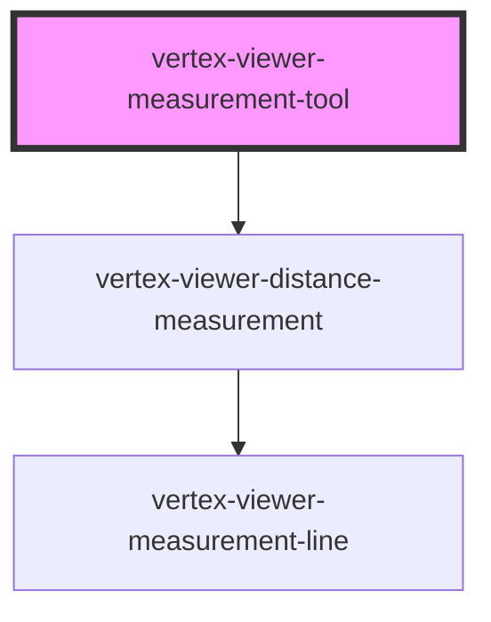

# vertex-viewer-measurement-tool

<!-- Auto Generated Below -->

## Properties

| Property   | Attribute   | Description | Type                                   | Default      |
| ---------- | ----------- | ----------- | -------------------------------------- | ------------ |
| `cssClass` | `css-class` |             | `string`                               | `''`         |
| `tool`     | `tool`      |             | `"distance"`                           | `'distance'` |
| `viewer`   | --          |             | `HTMLVertexViewerElement \| undefined` | `undefined`  |

## Events

| Event      | Description | Type                               |
| ---------- | ----------- | ---------------------------------- |
| `measured` |             | `CustomEvent<DistanceMeasurement>` |

## Dependencies

### Depends on

- [vertex-viewer-distance-measurement](../viewer-distance-measurement)

### Graph

----------------------------------------------

*Built with [StencilJS](https://stenciljs.com/)*
