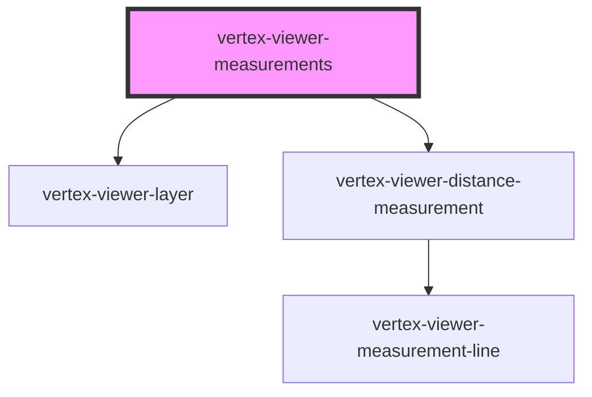

# vertex-viewer-measurements

<!-- Auto Generated Below -->

## Properties

| Property                | Attribute                 | Description | Type                                   | Default      |
| ----------------------- | ------------------------- | ----------- | -------------------------------------- | ------------ |
| `interactionOn`         | `interaction-on`          |             | `boolean`                              | `false`      |
| `selectedMeasurementId` | `selected-measurement-id` |             | `string \| undefined`                  | `undefined`  |
| `tool`                  | `tool`                    |             | `"distance"`                           | `'distance'` |
| `viewer`                | --                        |             | `HTMLVertexViewerElement \| undefined` | `undefined`  |

## Events

| Event                | Description | Type                                                      |
| -------------------- | ----------- | --------------------------------------------------------- |
| `measurementAdded`   |             | `CustomEvent<HTMLVertexViewerDistanceMeasurementElement>` |
| `measurementRemoved` |             | `CustomEvent<HTMLVertexViewerDistanceMeasurementElement>` |

## Methods

### `addMeasurement(data: AddMeasurementData) => Promise<HTMLVertexViewerDistanceMeasurementElement>`

#### Returns

Type: `Promise<HTMLVertexViewerDistanceMeasurementElement>`

### `getMeasurements() => Promise<HTMLVertexViewerDistanceMeasurementElement[]>`

#### Returns

Type: `Promise<HTMLVertexViewerDistanceMeasurementElement[]>`

### `removeMeasurement(id: string) => Promise<HTMLVertexViewerDistanceMeasurementElement | undefined>`

#### Returns

Type: `Promise<HTMLVertexViewerDistanceMeasurementElement | undefined>`

## Dependencies

### Depends on

- [vertex-viewer-layer](../viewer-layer)
- [vertex-viewer-distance-measurement](../viewer-distance-measurement)

### Graph

----------------------------------------------

*Built with [StencilJS](https://stenciljs.com/)*
