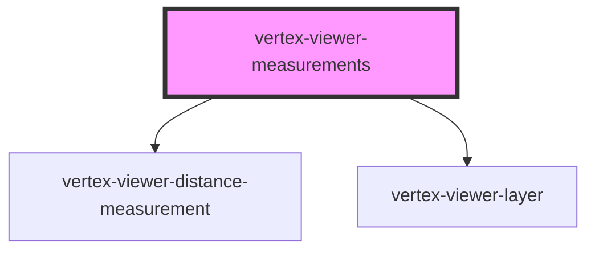

# vertex-viewer-measurements

<!-- Auto Generated Below -->

## Properties

| Property                | Attribute                 | Description | Type                                   | Default              |
| ----------------------- | ------------------------- | ----------- | -------------------------------------- | -------------------- |
| `interactionOn`         | `interaction-on`          |             | `boolean`                              | `false`              |
| `selectedMeasurementId` | `selected-measurement-id` |             | `string \| undefined`                  | `undefined`          |
| `tool`                  | `tool`                    |             | `"measure-distance"`                   | `'measure-distance'` |
| `viewer`                | --                        |             | `HTMLVertexViewerElement \| undefined` | `undefined`          |

## Events

| Event              | Description | Type                                                      |
| ------------------ | ----------- | --------------------------------------------------------- |
| `measurementAdded` |             | `CustomEvent<HTMLVertexViewerDistanceMeasurementElement>` |

## Dependencies

### Depends on

- [vertex-viewer-distance-measurement](../viewer-distance-measurement)
- [vertex-viewer-layer](../viewer-layer)

### Graph

----------------------------------------------

*Built with [StencilJS](https://stenciljs.com/)*
