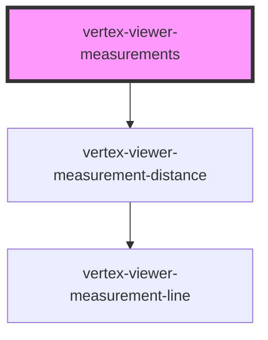

# vertex-viewer-measurements

The `<vertex-viewer-measurements>` component manages the presentation, creation
and editing of measurements for the viewer.

## Create Measurements UI

The `<vertex-viewer-measurement-tool>` can be added as a child to this component
to manage the creation of new measurements through user interactions. When a new
measurement is added, it's assigned an ID. This ID can be passed to
`getMeasurementElement` or `selected-measurement-id` to select a measurement.

**Note:** This feature requires that the depth buffers flag is enabled on the
viewer.

**Example:** Creating new measurements through user interaction.

```html
<html>
<body>
  <vertex-viewer src="urn:vertexvis:stream-key:my-key" depth-buffers="final">
    <vertex-viewer-measurements id="measurements">
      <vertex-viewer-measurement-tool></vertex-viewer-measurement-tool>
    </vertex-viewer-measurements>
  </vertex-viewer>

  <script type="module">
    const measurements = document.getElementById('measurements');

    // An event is dispatched whenever a new measurement is added.
    measurements.addEventListener('measurementAdded', (event) => {
      console.log(`Measurement added`, event.detail.id, event.detail.distance);
    })
  </script>
</body>
</html>
```

The measurement type to create can be customized using the `tool` attribute on
the component.

**Example:** Changing the measurement tool.

```html
<html>
<body>
  <vertex-viewer src="urn:vertexvis:stream-key:my-key" depth-buffers="final">
    <vertex-viewer-measurements tool="distance">
      <vertex-viewer-measurement-tool></vertex-viewer-measurement-tool>
    </vertex-viewer-measurements>
  </vertex-viewer>
</body>
</html>
```

## Create Measurements Programmatically.

Measurements can be added programmatically using the `addMeasurement()` or by
adding a measurement as a child of this component.

**Note:** For the component to manage selection for measurements added
as children, provide a unique ID to the element.

```html
<html>
<body>
  <button id="add-measurement-btn">Add Measurement</button>

  <vertex-viewer src="urn:vertexvis:stream-key:my-key" depth-buffers="final">
    <vertex-viewer-measurements id="measurements">
      <vertex-viewer-measurement-tool></vertex-viewer-measurement-tool>

      <!-- A measurement added as a child component -->
      <vertex-viewer-measurement-distance
        id="my-measurement-id"
        start-json="[100, -50, 200]"
        end-json="[500, 50, 100]"
      ></vertex-viewer-measurement-distance>
    </vertex-viewer-measurements>
  </vertex-viewer>

  <script type="module">
    import { DistanceMeasurement } from 'https://unpkg.com/@vertexvis/viewer@latest/dist/viewer/index.esm.js'

    const measurements = document.getElementById('measurements');
    const button = document.getElementById('add-measurement-btn');
    button.addEventListener('click', async () => {
      const measurement = new DistanceMeasurement({
        start: { x: 50, y: 100, z: 0 },
        end: { x: 90, y, 75, z: 100 },
      });

      // Returns the HTML element for the newly added measurement.
      const element = await measurements.addMeasurement(measurement);
    });
  </script>
</body>
</html>
```

## Units of Measurement

Units of measurement can be customized with the `units` and `fractional-digits`
attribute.

**Example:** Settings units and fractional digits.

```html
<html>
<body>
  <vertex-viewer src="urn:vertexvis:stream-key:my-key">
    <vertex-viewer-measurements
      units="inches"
      fractional-digits="1"
    ></vertex-viewer-measurements>
  </vertex-viewer>
</body>
</html>
```

## Styling Measurements

HTML templates and CSS variables are used to customize the styling of
measurements that are added programmatically or through user interaction. See
the documentation of
[`<vertex-viewer-measurement-distance>`](../viewer-distance-measurement/readme.md)
for all styling options.

When a new measurement is added, the measurement's HTML from the template will
be cloned and added to the component.

**Example:** Styling measurements.

```html
<html>
<head>
  <style>
    /* Styling for the measurement and its label */
    .measurement {
      --viewer-distance-measurement-accent-color: gold;
    }

    .measurement .label {
      background-color: var(--viewer-distance-measurement-accent-color);
      display: flex;
      align-items: center;
      justify-content: center;
      width: 24px;
      height: 24px;
    }
  </style>
</head>

<body>
  <!-- The template for distance measurement -->
  <template id="my-distance-measurement">
    <vertex-viewer-measurement-distance class="distance-measurement">
      <div slot="start-label" class="label">A</div>
      <div slot="start-label" class="label">B</div>
    </vertex-viewer-measurement-distance>
  </template>

  <vertex-viewer src="urn:vertexvis:stream-key:my-key" depth-buffers="final">
    <!-- Pass the template ID to use for distance measurements -->
    <vertex-viewer-measurements distance-template-id="my-distance-measurement">
      <vertex-viewer-measurement-tool></vertex-viewer-measurement-tool>
    </vertex-viewer-measurements>
  </vertex-viewer>
</body>
</html>
```

<!-- Auto Generated Below -->


## Properties

| Property                | Attribute                 | Description                                                                                                                                                       | Type                                                                          | Default                     |
| ----------------------- | ------------------------- | ----------------------------------------------------------------------------------------------------------------------------------------------------------------- | ----------------------------------------------------------------------------- | --------------------------- |
| `disabled`              | `disabled`                | If `true`, disables adding or editing of measurements through user interaction.                                                                                   | `boolean`                                                                     | `false`                     |
| `distanceTemplateId`    | `distance-template-id`    | An HTML template that describes the HTML to use for new distance measurements. It's expected that the template contains a `<vertex-viewer-measurement-distance>`. | `string \| undefined`                                                         | `undefined`                 |
| `fractionalDigits`      | `fractional-digits`       | The number of fractional digits to display measurements in.                                                                                                       | `number`                                                                      | `2`                         |
| `selectedMeasurementId` | `selected-measurement-id` | The ID of the measurement that is selected.                                                                                                                       | `string \| undefined`                                                         | `undefined`                 |
| `snapDistance`          | `snap-distance`           | The distance, in pixels, between the mouse and nearest snappable edge. A value of 0 disables snapping.                                                            | `number`                                                                      | `MEASUREMENT_SNAP_DISTANCE` |
| `tool`                  | `tool`                    | The type of measurement to perform.                                                                                                                               | `"distance"`                                                                  | `'distance'`                |
| `units`                 | `units`                   | The unit type to display measurements in.                                                                                                                         | `"centimeters" \| "feet" \| "inches" \| "meters" \| "millimeters" \| "yards"` | `'millimeters'`             |
| `viewer`                | --                        | The viewer to connect to measurements. If nested within a <vertex-viewer>, this property will be populated automatically.                                         | `HTMLVertexViewerElement \| undefined`                                        | `undefined`                 |


## Events

| Event                | Description                                                                                        | Type                                                      |
| -------------------- | -------------------------------------------------------------------------------------------------- | --------------------------------------------------------- |
| `measurementAdded`   | Dispatched when a new measurement is added, either through user interaction or programmatically.   | `CustomEvent<HTMLVertexViewerMeasurementDistanceElement>` |
| `measurementRemoved` | Dispatched when a new measurement is removed, either through user interaction or programmatically. | `CustomEvent<HTMLVertexViewerMeasurementDistanceElement>` |


## Methods

### `addMeasurement(measurement: Measurement) => Promise<HTMLVertexViewerMeasurementDistanceElement>`

Adds a new measurement as a child to this component. A new measurement
component will be created from the template specified by
`distance-template-id` or if undefined a default element will be created.

#### Returns

Type: `Promise<HTMLVertexViewerMeasurementDistanceElement>`

The measurement element that was created.

### `getMeasurementElement(id: string) => Promise<HTMLVertexViewerMeasurementDistanceElement | undefined>`

Returns the measurement element associated to the given ID.

#### Returns

Type: `Promise<HTMLVertexViewerMeasurementDistanceElement | undefined>`

A measurement element, or `undefined`.

### `getMeasurementElements() => Promise<HTMLVertexViewerMeasurementDistanceElement[]>`

Returns a list of measurement elements that are children of this component.

#### Returns

Type: `Promise<HTMLVertexViewerMeasurementDistanceElement[]>`

A list of all measurements.

### `removeMeasurement(id: string) => Promise<HTMLVertexViewerMeasurementDistanceElement | undefined>`

Removes a measurement with the given ID, and returns the HTML element
associated to the measurement. Returns `undefined` if no measurement is
found.

#### Returns

Type: `Promise<HTMLVertexViewerMeasurementDistanceElement | undefined>`

The measurement element, or undefined.


## Dependencies

### Depends on

- [vertex-viewer-measurement-distance](../viewer-measurement-distance)

### Graph


----------------------------------------------

*Built with [StencilJS](https://stenciljs.com/)*
