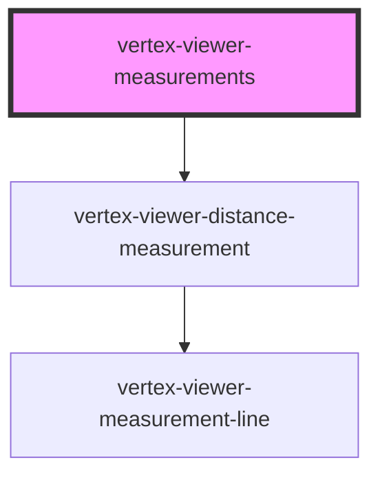

# vertex-viewer-measurements

<!-- Auto Generated Below -->

## Properties

| Property                | Attribute                 | Description                                                                                                                                                       | Type                                                                          | Default         |
| ----------------------- | ------------------------- | ----------------------------------------------------------------------------------------------------------------------------------------------------------------- | ----------------------------------------------------------------------------- | --------------- |
| `disabled`              | `disabled`                | If `true`, disables adding or editing of measurements through user interaction.                                                                                   | `boolean`                                                                     | `false`         |
| `distanceTemplateId`    | `distance-template-id`    | An HTML template that describes the HTML to use for new distance measurements. It's expected that the template contains a `<vertex-viewer-distance-measurement>`. | `string \| undefined`                                                         | `undefined`     |
| `fractionalDigits`      | `fractional-digits`       | The number of fractional digits to display measurements in.                                                                                                       | `number`                                                                      | `2`             |
| `selectedMeasurementId` | `selected-measurement-id` | The ID of the measurement that is selected.                                                                                                                       | `string \| undefined`                                                         | `undefined`     |
| `tool`                  | `tool`                    | The type of measurement to perform.                                                                                                                               | `"distance"`                                                                  | `'distance'`    |
| `units`                 | `units`                   | The unit type to display measurements in.                                                                                                                         | `"centimeters" \| "feet" \| "inches" \| "meters" \| "millimeters" \| "yards"` | `'millimeters'` |
| `viewer`                | --                        | The viewer to connect to measurements. If nested within a <vertex-viewer>, this property will be populated automatically.                                         | `HTMLVertexViewerElement \| undefined`                                        | `undefined`     |

## Events

| Event                | Description                                                                                        | Type                                                      |
| -------------------- | -------------------------------------------------------------------------------------------------- | --------------------------------------------------------- |
| `measurementAdded`   | Dispatched when a new measurement is added, either through user interaction or programmatically.   | `CustomEvent<HTMLVertexViewerDistanceMeasurementElement>` |
| `measurementRemoved` | Dispatched when a new measurement is removed, either through user interaction or programmatically. | `CustomEvent<HTMLVertexViewerDistanceMeasurementElement>` |

## Methods

### `addMeasurement(measurement: Measurement) => Promise<HTMLVertexViewerDistanceMeasurementElement>`

Adds a new measurement as a child to this component. A new measurement
component will be created from the template specified by
`distance-template-id` or if undefined a default element will be created.

#### Returns

Type: `Promise<HTMLVertexViewerDistanceMeasurementElement>`

### `getMeasurementElement(id: string) => Promise<HTMLVertexViewerDistanceMeasurementElement | undefined>`

Returns the measurement element associated to the given ID.

#### Returns

Type: `Promise<HTMLVertexViewerDistanceMeasurementElement | undefined>`

### `getMeasurementElements() => Promise<HTMLVertexViewerDistanceMeasurementElement[]>`

Returns a list of measurement elements that are children of this component.

#### Returns

Type: `Promise<HTMLVertexViewerDistanceMeasurementElement[]>`

### `removeMeasurement(id: string) => Promise<HTMLVertexViewerDistanceMeasurementElement | undefined>`

Removes a measurement with the given ID, and returns the HTML element
associated to the measurement. Returns `undefined` if no measurement is
found.

#### Returns

Type: `Promise<HTMLVertexViewerDistanceMeasurementElement | undefined>`

## Dependencies

### Depends on

- [vertex-viewer-distance-measurement](../viewer-distance-measurement)

### Graph

----------------------------------------------

*Built with [StencilJS](https://stenciljs.com/)*
