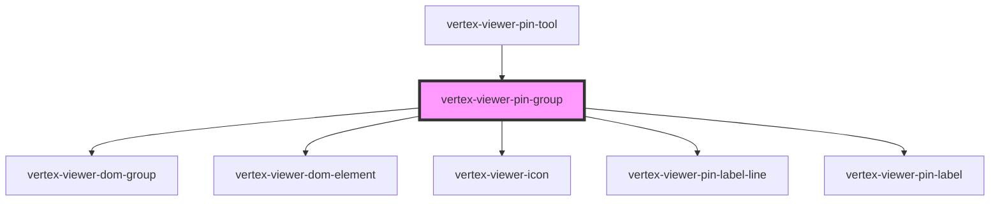

# vertex-viewer-annotation-pin

<!-- Auto Generated Below -->

## Properties

| Property               | Attribute  | Description                                                                      | Type                                                                                                                               | Default                  |
| ---------------------- | ---------- | -------------------------------------------------------------------------------- | ---------------------------------------------------------------------------------------------------------------------------------- | ------------------------ |
| `elementBounds`        | --         | The dimensions of the canvas for the pins                                        | `DOMRect \| undefined`                                                                                                             | `undefined`              |
| `matrix`               | --         | The local matrix of this element.                                                | `[number, number, number, number, number, number, number, number, number, number, number, number, number, number, number, number]` | `Matrix4.makeIdentity()` |
| `pin`                  | --         | The pin to draw for the group                                                    | `DefaultPin \| TextPin \| undefined`                                                                                               | `undefined`              |
| `pinController`        | --         | The controller that drives behavior for pin operations                           | `PinController \| undefined`                                                                                                       | `undefined`              |
| `pinModel`             | --         | The model that contains the entities and outcomes from performing pin operations | `PinModel`                                                                                                                         | `new PinModel()`         |
| `projectionViewMatrix` | --         | Projection view matrix used for computing the position of the pin line           | `[number, number, number, number, number, number, number, number, number, number, number, number, number, number, number, number]` | `Matrix4.makeIdentity()` |
| `selected`             | `selected` | Whether or not the pin is "selected"                                             | `boolean`                                                                                                                          | `false`                  |

## CSS Custom Properties

| Name                                        | Description                                            |
| ------------------------------------------- | ------------------------------------------------------ |
| `--viewer-annotations-pin-color`            | A CSS color that specifies the color of the pin        |
| `--viewer-annotations-pin-label-line-color` | A CSS color that specifies the color of the label line |

## Dependencies

### Used by

 - [vertex-viewer-pin-tool](../viewer-pin-tool)

### Depends on

- [vertex-viewer-dom-group](../viewer-dom-group)
- [vertex-viewer-dom-element](../viewer-dom-element)
- [vertex-viewer-icon](../viewer-icon)
- [vertex-viewer-pin-label-line](../viewer-pin-label-line)
- [vertex-viewer-pin-label](../viewer-pin-label)

### Graph

----------------------------------------------

*Built with [StencilJS](https://stenciljs.com/)*
