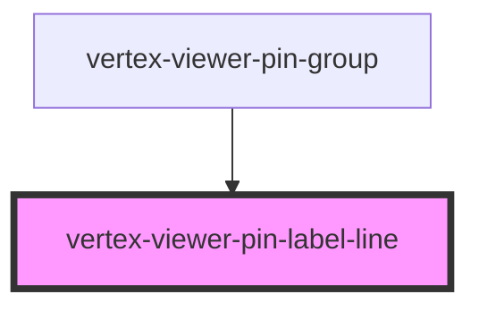

# vertex-viewer-annotation-pin

<!-- Auto Generated Below -->

## Properties

| Property     | Attribute | Description | Type                 | Default     |
| ------------ | --------- | ----------- | -------------------- | ----------- |
| `labelPoint` | --        |             | `Point \| undefined` | `undefined` |
| `pinPoint`   | --        |             | `Point \| undefined` | `undefined` |

## Dependencies

### Used by

 - [vertex-viewer-pin-group](../viewer-pin-group)

### Graph

----------------------------------------------

*Built with [StencilJS](https://stenciljs.com/)*
