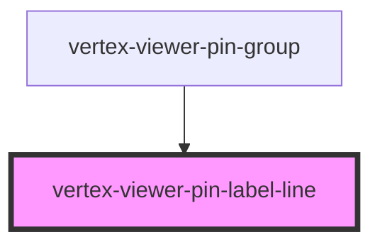

# vertex-viewer-annotation-pin

<!-- Auto Generated Below -->

## Properties

| Property             | Attribute | Description                         | Type                                           | Default                   |
| -------------------- | --------- | ----------------------------------- | ---------------------------------------------- | ------------------------- |
| `labelEl`            | --        |                                     | `HTMLVertexViewerPinLabelElement \| undefined` | `undefined`               |
| `labelPoint`         | --        |                                     | `Point \| undefined`                           | `undefined`               |
| `pin`                | --        | The pin to draw for the group       | `PinEntity \| TextPinEntity \| undefined`      | `undefined`               |
| `pinLabelDimensions` | --        | The dimensions of the the pin label | `Dimensions`                                   | `{ height: 0, width: 0 }` |
| `pinPoint`           | --        |                                     | `Point \| undefined`                           | `undefined`               |

## CSS Custom Properties

| Name                                        | Description                                            |
| ------------------------------------------- | ------------------------------------------------------ |
| `--viewer-annotations-pin-label-line-color` | A CSS color that specifies the color of the label line |
| `--viewer-annotations-pin-label-line-width` | A CSS color that specifies the width of the label line |

## Dependencies

### Used by

 - [vertex-viewer-pin-group](../viewer-pin-group)

### Graph

----------------------------------------------

*Built with [StencilJS](https://stenciljs.com/)*
