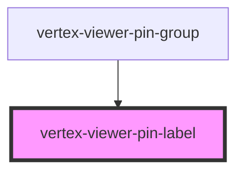

# vertex-viewer-annotation-pin

<!-- Auto Generated Below -->

## Properties

| Property             | Attribute | Description                                                                      | Type                         | Default                   |
| -------------------- | --------- | -------------------------------------------------------------------------------- | ---------------------------- | ------------------------- |
| `dimensions`         | --        | The dimensions of the canvas for the pins                                        | `Dimensions`                 | `{ height: 0, width: 0 }` |
| `pin`                | --        | The pin to draw for the group                                                    | `TextPinEntity \| undefined` | `undefined`               |
| `pinController`      | --        | The model that contains the entities and outcomes from performing pin operations | `PinController \| undefined` | `undefined`               |
| `pinLabelDimensions` | --        | The dimensions of the the pin label                                              | `Dimensions`                 | `{ height: 0, width: 0 }` |
| `pinModel`           | --        | The model that contains the entities and outcomes from performing pin operations | `PinModel`                   | `new PinModel()`          |
| `value`              | `value`   | The current text value of the component. Value is updated on user interaction.   | `string`                     | `''`                      |

## Methods

### `setFocus() => Promise<void>`

Gives focus to the the component's internal text input.

#### Returns

Type: `Promise<void>`

## CSS Custom Properties

| Name                                              | Description                                                  |
| ------------------------------------------------- | ------------------------------------------------------------ |
| `--viewer-annotations-pin-label-background-color` | A CSS color that specifies the color of the label background |

## Dependencies

### Used by

 - [vertex-viewer-pin-group](../viewer-pin-group)

### Graph

----------------------------------------------

*Built with [StencilJS](https://stenciljs.com/)*
