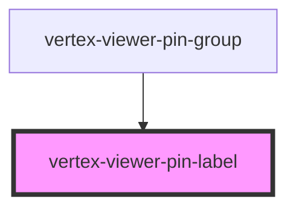

# vertex-viewer-pin-label

<!-- Auto Generated Below -->

## Properties

| Property        | Attribute | Description                                                                    | Type                         | Default     |
| --------------- | --------- | ------------------------------------------------------------------------------ | ---------------------------- | ----------- |
| `elementBounds` | --        | The dimensions of the canvas for the pins                                      | `DOMRect \| undefined`       | `undefined` |
| `pin`           | --        | The pin to draw for the group                                                  | `TextPin \| undefined`       | `undefined` |
| `pinController` | --        | The controller that drives behavior for pin operations                         | `PinController \| undefined` | `undefined` |
| `value`         | `value`   | The current text value of the component. Value is updated on user interaction. | `string`                     | `undefined` |

## Events

| Event          | Description                                                                                                    | Type                               |
| -------------- | -------------------------------------------------------------------------------------------------------------- | ---------------------------------- |
| `labelBlurred` | Emitted whenever the label is blurred, with the ID of the associated pin (or undefined if no pin is provided). | `CustomEvent<string \| undefined>` |
| `labelFocused` | Emitted whenever the label is focused, with the ID of the associated pin (or undefined if no pin is provided). | `CustomEvent<string \| undefined>` |

## Methods

### `setFocus() => Promise<void>`

Gives focus to the the component's internal text input.

#### Returns

Type: `Promise<void>`

## CSS Custom Properties

| Name                                                  | Description                                                                           |
| ----------------------------------------------------- | ------------------------------------------------------------------------------------- |
| `--viewer-annotations-pin-label-background-color`     | A CSS color that specifies the color of the label background                          |
| `--viewer-annotations-pin-label-border-color`         | A CSS color that specifies the color of the label's border                            |
| `--viewer-annotations-pin-label-border-radius`        | A var that specifies the border radius of the label                                   |
| `--viewer-annotations-pin-label-border-style`         | A CSS variable that specifies the style of border on this label. Defaults to `solid`. |
| `--viewer-annotations-pin-label-border-width`         | A CSS length that specifies the width of the border on this label. Defaults to `2px`. |
| `--viewer-annotations-pin-label-color`                | A CSS color that specifies the color of the label                                     |
| `--viewer-annotations-pin-label-focused-border-color` | A CSS color that specifies the color of the label's border when focused.              |
| `--viewer-annotations-pin-label-max-height`           | A CSS length that specifies the maximum height of the label. Defaults to `50rem`.     |
| `--viewer-annotations-pin-label-max-width`            | A CSS length that specifies the maximum width of the label. Defaults to `25rem`.      |
| `--viewer-annotations-pin-label-min-width`            | A CSS length that specifies the minimum width of the label. Defaults to `2rem`.       |
| `--viewer-annotations-pin-label-padding-x`            | A var that specifies the horizontal padding of the label                              |
| `--viewer-annotations-pin-label-padding-y`            | A var that specifies the vertical padding of the label                                |

## Dependencies

### Used by

 - [vertex-viewer-pin-group](../viewer-pin-group)

### Graph

----------------------------------------------

*Built with [StencilJS](https://stenciljs.com/)*
