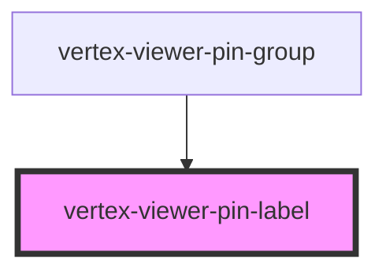

# vertex-viewer-annotation-pin

<!-- Auto Generated Below -->

## Properties

| Property        | Attribute | Description                                                                    | Type                         | Default     |
| --------------- | --------- | ------------------------------------------------------------------------------ | ---------------------------- | ----------- |
| `elementBounds` | --        | The dimensions of the canvas for the pins                                      | `DOMRect \| undefined`       | `undefined` |
| `pin`           | --        | The pin to draw for the group                                                  | `TextPin \| undefined`       | `undefined` |
| `pinController` | --        | The controller that drives behavior for pin operations                         | `PinController \| undefined` | `undefined` |
| `value`         | `value`   | The current text value of the component. Value is updated on user interaction. | `string`                     | `undefined` |

## Methods

### `setFocus() => Promise<void>`

Gives focus to the the component's internal text input.

#### Returns

Type: `Promise<void>`

## Dependencies

### Used by

 - [vertex-viewer-pin-group](../viewer-pin-group)

### Graph

----------------------------------------------

*Built with [StencilJS](https://stenciljs.com/)*
