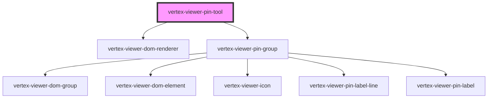

# vertex-viewer-annotation-pin

<!-- Auto Generated Below -->

## Properties

| Property        | Attribute | Description                                                                                                                      | Type                                   | Default          |
| --------------- | --------- | -------------------------------------------------------------------------------------------------------------------------------- | -------------------------------------- | ---------------- |
| `mode`          | `mode`    | The mode of the pin tool                                                                                                         | `"edit" \| "view"`                     | `'view'`         |
| `pinController` | --        | The controller that is responsible for drawing pins and updating the model                                                       | `PinController \| undefined`           | `undefined`      |
| `pinModel`      | --        | The model that contains the entities and outcomes from performing pin annotations                                                | `PinModel`                             | `new PinModel()` |
| `pins`          | --        |                                                                                                                                  | `Pin[]`                                | `[]`             |
| `tool`          | `tool`    | The type of pin.  This property will automatically be set.                                                                       | `"pin" \| "pin-label"`                 | `'pin'`          |
| `viewer`        | --        | The viewer that this component is bound to. This is automatically assigned if added to the light-dom of a parent viewer element. | `HTMLVertexViewerElement \| undefined` | `undefined`      |

## CSS Custom Properties

| Name                                        | Description                                            |
| ------------------------------------------- | ------------------------------------------------------ |
| `--viewer-annotations-pin-label-line-color` | A CSS color that specifies the color of the label line |

## Dependencies

### Depends on

- [vertex-viewer-dom-renderer](../viewer-dom-renderer)
- [vertex-viewer-pin-group](../viewer-pin-group)

### Graph

----------------------------------------------

*Built with [StencilJS](https://stenciljs.com/)*
