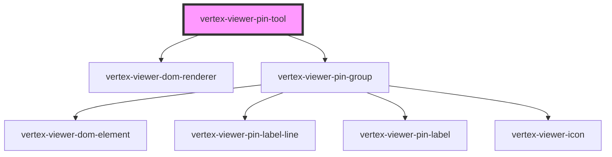

# vertex-viewer-pin-tool


The `<vertex-viewer-pin-tool>` is a component for displaying & adding/editing pin objects on the scene on 3D points. The component
supports adding a "simple" pin, as well as a text pin that has an anchor dot on the model with a relative 2d label that the consumer can drag
to any relative position on the canvas. 


**Example:** Using the tool and adding/drawing pins

```html
<html>
<body>
  <vertex-viewer id="viewer" src="urn:vertexvis:stream-key:my-key">
    <vertex-viewer-pin-tool
      id="vertex-viewer-pin-tool"
      mode="edit"
      tool="pin-text"
    >
    </vertex-viewer-pin-tool>
  </vertex-viewer>
</body>
</html>
```

To draw pins you can do so by setting the pins on the controller exposed via the SDK

```js
  const pinsTool = document.getElementById('vertex-viewer-pin-tool');

  pinsTool.pinController.setPins(pins); // where 'pins' is a set of pins.
```


<!-- Auto Generated Below -->


## Properties

| Property        | Attribute       | Description                                                                                                                      | Type                                   | Default          |
| --------------- | --------------- | -------------------------------------------------------------------------------------------------------------------------------- | -------------------------------------- | ---------------- |
| `accentColor`   | `accent-color`  | The accent color for new pins.                                                                                                   | `Color \| string \| undefined`         | `undefined`      |
| `mode`          | `mode`          | The mode of the pin tool                                                                                                         | `"edit" \| "view"`                     | `'view'`         |
| `pinController` | --              | The controller that is responsible for drawing pins and updating the model                                                       | `PinController \| undefined`           | `undefined`      |
| `pinModel`      | --              | The model that contains the entities and outcomes from performing pin annotations                                                | `PinModel`                             | `new PinModel()` |
| `primaryColor`  | `primary-color` | The primary color for new pins.                                                                                                  | `Color \| string \| undefined`         | `undefined`      |
| `tool`          | `tool`          | The type of pin.  This property will automatically be set.                                                                       | `"pin-icon" \| "pin-text"`             | `'pin-icon'`     |
| `viewer`        | --              | The viewer that this component is bound to. This is automatically assigned if added to the light-dom of a parent viewer element. | `HTMLVertexViewerElement \| undefined` | `undefined`      |


## Dependencies

### Depends on

- [vertex-viewer-dom-renderer](../viewer-dom-renderer)
- [vertex-viewer-pin-group](../viewer-pin-group)

### Graph


----------------------------------------------

*Built with [StencilJS](https://stenciljs.com/)*
