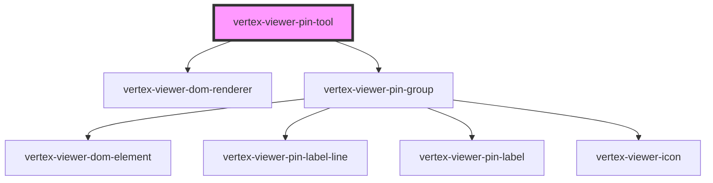

# vertex-viewer-pin-tool

The `<vertex-viewer-pin-tool>` is a component for displaying and authoring
pin objects on the scene on 3D points. The component supports adding a simple
pin, as well as a text pin that has an anchor dot on the model with a relative
2D label that the consumer can drag to any relative position on the canvas.

**Example:** Using the tool to add pins.

```html
<html>
<body>
  <vertex-viewer id="viewer" src="urn:vertexvis:stream-key:my-key">
    <vertex-viewer-pin-tool id="pin-tool" mode="edit" tool="pin-text">
    </vertex-viewer-pin-tool>
  </vertex-viewer>
</body>
</html>
```

## Pin Types

The component supports rendering a simple icon pin and a more advanced text pin
that may contain user-supplied text. You can change the type of pins authored on
the tool by setting the `tool` attribute.

**Example:** Toggling between icon and text pins.

```html
<html>
<body>
  <vertex-viewer id="viewer" src="urn:vertexvis:stream-key:my-key">
    <vertex-viewer-pin-tool id="pin-tool" mode="edit" tool="pin-icon">
    </vertex-viewer-pin-tool>

    <vertex-viewer-toolbar placement="bottom-center">
      <button id="toggle-btn">Toggle Pin Type</button>
    </vertex-viewer-toolbar>
  </vertex-viewer>

  <script type="module">
    window.addEventListener('load', () => main());

    function main(): void {
      const pinTool = document.getElementById('pin-tool');

      // Use the controller to clear all displayed pins.
      const toggleBtn = document.getElementById('toggle-btn');
      toggleBtn.addEventListener('click', () => {
        pinTool.tool = pinTool.tool === 'pin-icon' ? 'pin-text' : 'pin-icon';
      });
    }
  </script>
</body>
</html>
```

## Pin Model and Pin Controller

The `PinModel` represents the internal data model of the pin tool and exposes
observers that can be used to know when the data model changes. The
`PinController` contains methods and business logic for modifying the model.

The component uses the `PinController` and `PinModel` to perform pin operations
based on user interactions, and redraw pins when the data model changes. It also
exposes the controller and model for your application to programmatically
operate on pins.

**Example:** Using the pin controller and model.

```html
<html>
<body>
  <vertex-viewer id="viewer" src="urn:vertexvis:stream-key:my-key">
    <vertex-viewer-pin-tool id="pin-tool" mode="edit" tool="pin-text">
    </vertex-viewer-pin-tool>

    <vertex-viewer-toolbar placement="bottom-center">
      <button id="clear-btn">Clear</button>
      <button id="log-btn">Log Pins</button>
    </vertex-viewer-toolbar>
  </vertex-viewer>

  <script type="module">
    window.addEventListener('load', () => main());

    function main(): void {
      const pinTool = document.getElementById('pin-tool');

      // Use the model to be notified when pins have changed. Returns a
      // `Disposable` to remove listener. Needed to avoid memory leaks.
      const disposable = pinTool.pinModel.onEntitiesChanged((pins) => {
        console.log('Pins changed:', pins);
      });

      // Use the controller to clear all displayed pins.
      const clearBtn = document.getElementById('clear-btn');
      clearBtn.addEventListener('click', () => {
        pinTool.pinController.clearPins();
      });

      // Use the model to query all displayed pins.
      const logBtn = document.getElementById('log-btn');
      logBtn.addEventListener('click', () => {
        console.log('Pins:', pinTool.pinModel.getPins());
      });
    }
  </script>
</body>
</html>
```

## Persisting and Rehydrating Pins

The SDK does not support the persistence of pins to Vertex. However, through the
pin model and controller, you can export them, persist them to an internal
storage mechanism, then rehydrate them.

**Example:** Persisting and rehydrating pins to an external data source.

```html
<html>
<body>
  <vertex-viewer id="viewer" src="urn:vertexvis:stream-key:my-key">
    <vertex-viewer-pin-tool id="pin-tool" mode="edit" tool="pin-text">
    </vertex-viewer-pin-tool>

    <vertex-viewer-toolbar placement="bottom-center">
      <button id="save-btn">Save</button>
      <button id="clear-btn">Clear</button>
      <button id="load-btn">Load</button>
    </vertex-viewer-toolbar>
  </vertex-viewer>

  <script type="module">
    window.addEventListener('load', () => main());

    function main(): void {
      const pinTool = document.getElementById('pin-tool');

      // Use the model to query all displayed pins and persist them.
      const saveBtn = document.getElementById('save-btn');
      saveBtn.addEventListener('click', () => {
        const pins = pinTool.pinModel.getPins();
        savePins(pins);
      });

      // Use the controller to clear all displayed pins.
      const clearBtn = document.getElementById('clear-btn');
      clearBtn.addEventListener('click', () => {
        pinTool.pinController.clearPins();
      });

      // Use the controller to rehydrate the pins.
      const loadBtn = document.getElementById('load-btn');
      loadBtn.addEventListener('click', () => {
        const pins = loadPins();
        pinTool.pinController.setPins(new Set(pins));
      })
    }

    function savePins(pins) {
      const json = JSON.stringify(pins);
      window.sessionStorage.setItem('pins', json);
    }

    function loadPins() {
      const json = window.sessionStorage.getItem('pins') ?? '[]';
      return JSON.parse(json);
    }
  </script>
</body>
</html>
```


<!-- Auto Generated Below -->


## Properties

| Property        | Attribute       | Description                                                                                                                                                                                                                 | Type                                   | Default          |
| --------------- | --------------- | --------------------------------------------------------------------------------------------------------------------------------------------------------------------------------------------------------------------------- | -------------------------------------- | ---------------- |
| `accentColor`   | `accent-color`  | The accent color for new pins. Setting this will override the accent template color, and will be used for any new pins created with this `vertex-viewer-pin-tool`. This styling applies to some background colors, etc      | `Color \| string \| undefined`         | `undefined`      |
| `mode`          | `mode`          | The mode of the pin tool                                                                                                                                                                                                    | `"edit" \| "view"`                     | `'view'`         |
| `pinController` | --              | The controller that is responsible for drawing pins and updating the model                                                                                                                                                  | `PinController \| undefined`           | `undefined`      |
| `pinModel`      | --              | The model that contains the entities and outcomes from performing pin annotations                                                                                                                                           | `PinModel`                             | `new PinModel()` |
| `primaryColor`  | `primary-color` | The primary color for new pins. Setting this will override the primary template color, and will be used for any new pins created with this `vertex-viewer-pin-tool`. This styling applies to pin anchors, and borders, etc. | `Color \| string \| undefined`         | `undefined`      |
| `tool`          | `tool`          | The type of pin.  This property will automatically be set.                                                                                                                                                                  | `"pin-icon" \| "pin-text"`             | `'pin-icon'`     |
| `viewer`        | --              | The viewer that this component is bound to. This is automatically assigned if added to the light-dom of a parent viewer element.                                                                                            | `HTMLVertexViewerElement \| undefined` | `undefined`      |


## Dependencies

### Depends on

- [vertex-viewer-dom-renderer](../viewer-dom-renderer)
- [vertex-viewer-pin-group](../viewer-pin-group)

### Graph


----------------------------------------------

*Built with [StencilJS](https://stenciljs.com/)*
