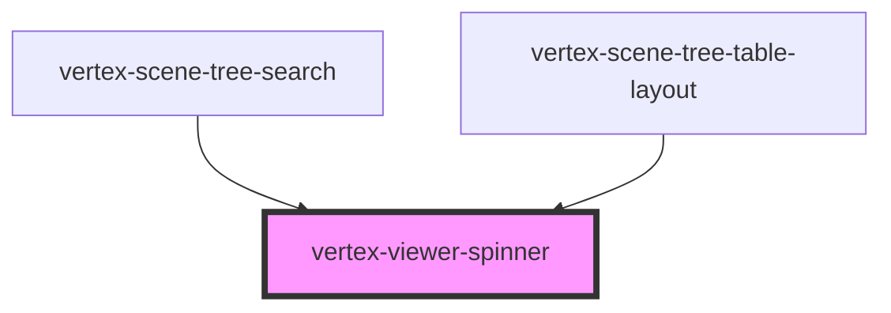

# vertex-viewer-spinner

<!-- Auto Generated Below -->

## Properties

| Property | Attribute | Description                                                                                                                                                        | Type                                        | Default |
| -------- | --------- | ------------------------------------------------------------------------------------------------------------------------------------------------------------------ | ------------------------------------------- | ------- |
| `size`   | `size`    | The size of the spinner. Can be `'xs' \| 'sm' \| 'md' \| 'lg' \| undefined`. Predefined sizes are set to:   * `xm`: 16px  * `sm`: 23px  * `md`: 32px  * `lg`: 64px | `"lg" \| "md" \| "sm" \| "xs" \| undefined` | `'md'`  |

## Dependencies

### Used by

 - [vertex-scene-tree-search](../scene-tree-search)
 - [vertex-scene-tree-table-layout](../scene-tree-table-layout)

### Graph

----------------------------------------------

*Built with [StencilJS](https://stenciljs.com/)*
