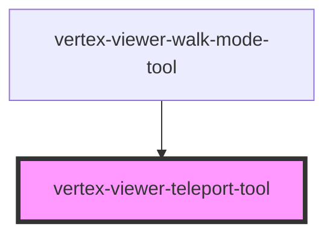

# vertex-viewer-teleport-tool

<!-- Auto Generated Below -->

## Properties

| Property             | Attribute             | Description                                                                                                                                                                                                                                                                                                                                                                                                                                                                           | Type                                              | Default               |
| -------------------- | --------------------- | ------------------------------------------------------------------------------------------------------------------------------------------------------------------------------------------------------------------------------------------------------------------------------------------------------------------------------------------------------------------------------------------------------------------------------------------------------------------------------------- | ------------------------------------------------- | --------------------- |
| `animationMs`        | `animation-ms`        | The duration of animations, in milliseconds. Defaults to `1000`.                                                                                                                                                                                                                                                                                                                                                                                                                      | `number \| undefined`                             | `1000`                |
| `animationsDisabled` | `animations-disabled` | Indicates whether animations will be used when performing camera operations. Defaults to `true`.                                                                                                                                                                                                                                                                                                                                                                                      | `boolean`                                         | `false`               |
| `controller`         | --                    |                                                                                                                                                                                                                                                                                                                                                                                                                                                                                       | `WalkModeController \| undefined`                 | `undefined`           |
| `mode`               | `mode`                | The type of teleportation to perform when clicking.  `teleport` - the camera's `position` is moved to the location of the hit result constrained by the plane represented by the camera's current `position` and `up` vectors.  `teleport-and-align` - the camera's `position`, `lookAt`, and `up` vectors are updated to align to the plane represented by the hit result's position and normal.  `undefined` - no teleportation will occur when clicking.  Defaults to `undefined`. | `"teleport" \| "teleport-and-align" \| undefined` | `undefined`           |
| `model`              | --                    |                                                                                                                                                                                                                                                                                                                                                                                                                                                                                       | `WalkModeModel`                                   | `new WalkModeModel()` |
| `viewer`             | --                    | The viewer that this component is bound to. This is automatically assigned if added to the light-dom of a parent viewer element.                                                                                                                                                                                                                                                                                                                                                      | `HTMLVertexViewerElement \| undefined`            | `undefined`           |

## Events

| Event               | Description                                                                    | Type                              |
| ------------------- | ------------------------------------------------------------------------------ | --------------------------------- |
| `controllerChanged` | Event emitted when the `WalkModeController` associated with this tool changes. | `CustomEvent<WalkModeController>` |

## Dependencies

### Used by

 - [vertex-viewer-walk-mode-tool](../viewer-walk-mode-tool)

### Graph

----------------------------------------------

*Built with [StencilJS](https://stenciljs.com/)*
