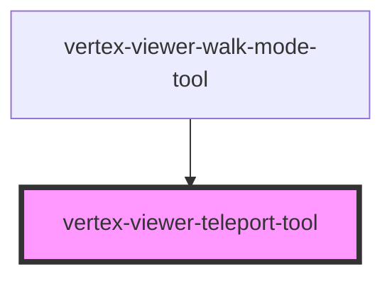

# vertex-viewer-teleport-tool

<!-- Auto Generated Below -->

## Overview

The `<vertex-viewer-teleport-tool>` allows for click-based "teleportation"
around a model, which is particularly useful for walking through a model.
This tool is automatically included as part of the <vertex-viewer-walk-mode-tool>.

## Properties

| Property             | Attribute             | Description                                                                                                                                                                                                                                                                                                                                                                                                                                                                                                                                                                                                                                                                                  | Type                                                                   | Default               |
| -------------------- | --------------------- | -------------------------------------------------------------------------------------------------------------------------------------------------------------------------------------------------------------------------------------------------------------------------------------------------------------------------------------------------------------------------------------------------------------------------------------------------------------------------------------------------------------------------------------------------------------------------------------------------------------------------------------------------------------------------------------------- | ---------------------------------------------------------------------- | --------------------- |
| `animationMs`        | `animation-ms`        | The duration of animations, in milliseconds. Defaults to `500`.                                                                                                                                                                                                                                                                                                                                                                                                                                                                                                                                                                                                                              | `number \| undefined`                                                  | `500`                 |
| `animationsDisabled` | `animations-disabled` | Indicates whether animations will be used when performing camera operations. Defaults to `false`.                                                                                                                                                                                                                                                                                                                                                                                                                                                                                                                                                                                            | `boolean`                                                              | `false`               |
| `controller`         | --                    |                                                                                                                                                                                                                                                                                                                                                                                                                                                                                                                                                                                                                                                                                              | `WalkModeController \| undefined`                                      | `undefined`           |
| `mode`               | `mode`                | The type of teleportation to perform when clicking.  `teleport` - the camera's `position` is moved to the location of the hit result constrained by the plane represented by the camera's current `position` and `up` vectors.  `teleport-and-align` - the camera's `position`, `lookAt`, and `up` vectors are updated to align to the plane represented by the hit result's position and normal.  `teleport-toward` - the camera's `position` is moved a fixed distance toward the location of the hit result constrained by the plane represented by the camera's current `position` and `up` vectors.  `undefined` - no teleportation will occur when clicking.  Defaults to `undefined`. | `"teleport" \| "teleport-and-align" \| "teleport-toward" \| undefined` | `undefined`           |
| `model`              | --                    |                                                                                                                                                                                                                                                                                                                                                                                                                                                                                                                                                                                                                                                                                              | `WalkModeModel`                                                        | `new WalkModeModel()` |
| `viewer`             | `viewer`              | The viewer that this component is bound to. This is automatically assigned if added to the light-dom of a parent viewer element.                                                                                                                                                                                                                                                                                                                                                                                                                                                                                                                                                             | `any`                                                                  | `undefined`           |

## Events

| Event               | Description                                                                    | Type                              |
| ------------------- | ------------------------------------------------------------------------------ | --------------------------------- |
| `controllerChanged` | Event emitted when the `WalkModeController` associated with this tool changes. | `CustomEvent<WalkModeController>` |

## Dependencies

### Used by

 - [vertex-viewer-walk-mode-tool](../viewer-walk-mode-tool)

### Graph

----------------------------------------------

*Built with [StencilJS](https://stenciljs.com/)*
