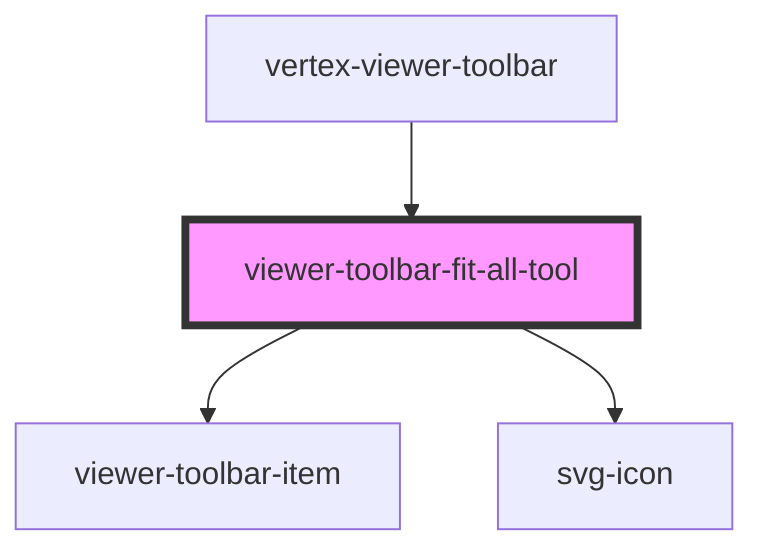

# viewer-toolbar-fit-all-tool

The `viewer-toolbar-fit-all-tool` element is a simple camera tool that renders a button-like element
that will perform the `fitToVisibleParts` method on the injected `vertex-viewer` element when clicked.

<!-- Auto Generated Below -->

## Properties

| Property | Attribute | Description                                                                                                                                                                                 | Type                      | Default     |
| -------- | --------- | ------------------------------------------------------------------------------------------------------------------------------------------------------------------------------------------- | ------------------------- | ----------- |
| `viewer` | --        | The `vertex-viewer` component that this toolbar will interact with. This property can be injected by the `vertex-viewer` when a `data-viewer="{{viewer element id}}"` attribute is present. | `HTMLVertexViewerElement` | `undefined` |

## Dependencies

### Used by

 - [vertex-viewer-toolbar](../viewer-toolbar)

### Depends on

- [viewer-toolbar-item](../viewer-toolbar-item)
- [svg-icon](../../icons)

### Graph

----------------------------------------------

*Built with [StencilJS](https://stenciljs.com/)*
