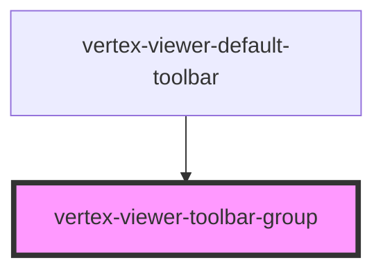

# vertex-viewer-toolbar-group

A `<vertex-viewer-toolbar-group>` is an element that groups related UI controls
within a `<vertex-viewer-toolbar>`.

## Styling

By default, this component only provides the necessary CSS to layout elements
within a group and does not provide any styling. You can customize borders,
backgrounds, and padding through CSS.

```html
<style>
  .group {
    border: 1px solid grey;
    background: lightgrey;
    padding: 0.25rem;
  }
</style>

<vertex-viewer-toolbar>
  <vertex-viewer-toolbar-group class="group">
    <button>Click Me</button>
  </vertex-viewer-toolbar-group>
</vertex-viewer-toolbar>
```

## Direction

By default, elements flow horizontally. You can change the flow direction using
the `direction` property.

```html
<vertex-viewer-toolbar-group direction="vertical"></vertex-viewer-toolbar-group>
```

<!-- Auto Generated Below -->


## Properties

| Property    | Attribute   | Description | Type                         | Default        |
| ----------- | ----------- | ----------- | ---------------------------- | -------------- |
| `direction` | `direction` |             | `"horizontal" \| "vertical"` | `'horizontal'` |


## Dependencies

### Used by

 - [vertex-viewer-default-toolbar](../viewer-default-toolbar)

### Graph


----------------------------------------------

*Built with [StencilJS](https://stenciljs.com/)*
