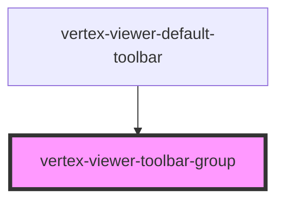

# vertex-viewer-toolbar-group

<!-- Auto Generated Below -->

## CSS Custom Properties

| Name    | Description                                                       |
| ------- | ----------------------------------------------------------------- |
| `--gap` | The spacing between elements in the group. Defaults to `0.25rem`. |

## Dependencies

### Used by

 - [vertex-viewer-default-toolbar](../viewer-default-toolbar)

### Graph

----------------------------------------------

*Built with [StencilJS](https://stenciljs.com/)*
