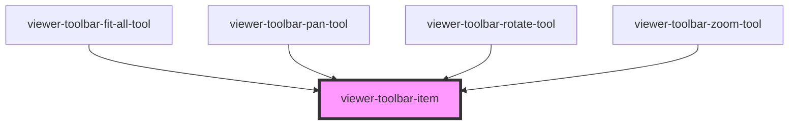

# viewer-toolbar-item

The `viewer-toolbar-item` element provides a wrapper around the children passed to it that will
apply the same styling to each item as the default `vertex-viewer-toolbar`. Additionally, the
`viewer-toolbar-item` provides properties for configuring the click behavior of the item, and
whether it should appear with selected styling.

## Style Overrides

| Variable Name                                           | Description                                                                   | Default   |
| ------------------------------------------------------- | ----------------------------------------------------------------------------- | --------- |
| `--vertex-viewer-toolbar-item-color`                    | The default color of the item toolbar item (applied when `selected` is false) | `#444444` |
| `--vertex-viewer-toolbar-item-selected-color`           | The selected color of the toolbar item (applied when `selected` is true)      | `#e0e0e0` |
| `--vertex-viewer-toolbar-item-hovered-background-color` | The background color applied to the toolbar item on hover                     | `#006bad` |
| `--vertex-viewer-toolbar-item-content-width`            | The width of the content contained in the toolbar item                        | `24px`    |
| `--vertex-viewer-toolbar-item-content-height`           | The height of the content contained in the toolbar item                       | `24px`    |

<!-- Auto Generated Below -->

## Properties

| Property   | Attribute  | Description                                                                                    | Type      | Default     |
| ---------- | ---------- | ---------------------------------------------------------------------------------------------- | --------- | ----------- |
| `selected` | `selected` | Whether this element should be displayed with conditional styling for a selected toolbar item. | `boolean` | `undefined` |

## Dependencies

### Used by

 - [viewer-toolbar-fit-all-tool](../viewer-toolbar-fit-all-tool)
 - [viewer-toolbar-pan-tool](../viewer-toolbar-pan-tool)
 - [viewer-toolbar-rotate-tool](../viewer-toolbar-rotate-tool)
 - [viewer-toolbar-zoom-tool](../viewer-toolbar-zoom-tool)

### Graph

----------------------------------------------

*Built with [StencilJS](https://stenciljs.com/)*
