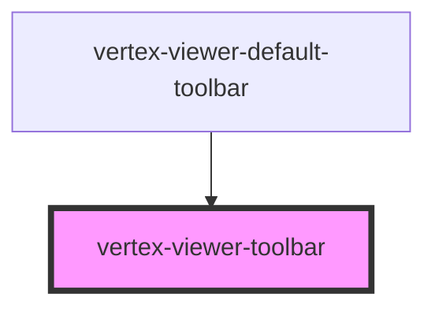

# vertex-viewer-toolbar

<!-- Auto Generated Below -->

## Properties

| Property   | Attribute  | Description                                                                                                                                                                       | Type                                                                                              | Default           |
| ---------- | ---------- | --------------------------------------------------------------------------------------------------------------------------------------------------------------------------------- | ------------------------------------------------------------------------------------------------- | ----------------- |
| `position` | `position` | Specifies where the toolbar is positioned. Can be `'top-left' \| 'top-center' \| 'top-right' \| 'bottom-left' \| 'bottom-center' \| 'bottom-right'`. Defaults to `bottom-center`. | `"bottom-center" \| "bottom-left" \| "bottom-right" \| "top-center" \| "top-left" \| "top-right"` | `'bottom-center'` |

## Dependencies

### Used by

 - [vertex-viewer-default-toolbar](../viewer-default-toolbar)

### Graph

----------------------------------------------

*Built with [StencilJS](https://stenciljs.com/)*
