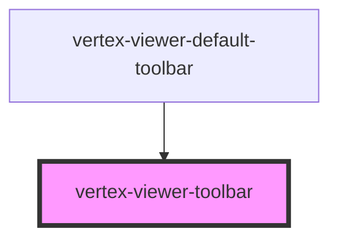

# vertex-viewer-toolbar

<!-- Auto Generated Below -->

## CSS Custom Properties

| Name    | Description                                                        |
| ------- | ------------------------------------------------------------------ |
| `--gap` | The spacing between elements in the toolbar. Defaults to `0.5rem`. |

## Dependencies

### Used by

 - [vertex-viewer-default-toolbar](../viewer-default-toolbar)

### Graph

----------------------------------------------

*Built with [StencilJS](https://stenciljs.com/)*
