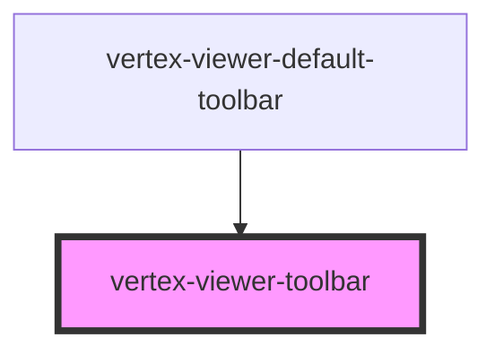

# vertex-viewer-toolbar

A `<vertex-viewer-toolbar>` is an element that contains UI controls that
interact with the viewer. They're intended to be placed inside a
`<vertex-viewer>` element and positioned on an edge in the viewer.

## Placement

The toolbar can place its elements in either a corner or side of the viewer
using the `placement` property.

```html
<vertex-viewer>
  <vertex-viewer-toolbar placement="top-left"></vertex-viewer-toolbar>
</vertex-viewer>
```

## Direction

The direction that elements flow is configurable using the `direction` property.
By default, elements flow horizontally. When used in conjunction with the
`placement` property, you can create vertical toolbars placed on the left or
right of the viewer.

```html
<vertex-viewer>
  <vertex-viewer-toolbar placement="middle-left" direction="vertical">
    <vertex-viewer-toolbar-group direction="vertical"></vertex-viewer-toolbar-group>
  </vertex-viewer-toolbar>
</vertex-viewer>
```

<!-- Auto Generated Below -->


## Properties

| Property    | Attribute   | Description                                | Type                                                                                                                                 | Default           |
| ----------- | ----------- | ------------------------------------------ | ------------------------------------------------------------------------------------------------------------------------------------ | ----------------- |
| `direction` | `direction` |                                            | `"horizontal" \| "vertical"`                                                                                                         | `'horizontal'`    |
| `placement` | `placement` | Specifies where the toolbar is positioned. | `"bottom-center" \| "bottom-left" \| "bottom-right" \| "middle-left" \| "middle-right" \| "top-center" \| "top-left" \| "top-right"` | `'bottom-center'` |


## Dependencies

### Used by

 - [vertex-viewer-default-toolbar](../viewer-default-toolbar)

### Graph


----------------------------------------------

*Built with [StencilJS](https://stenciljs.com/)*
