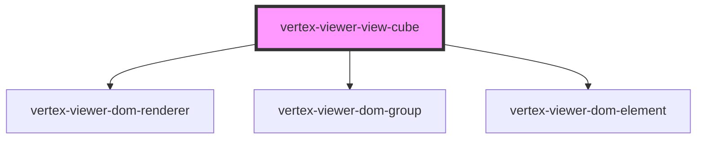

# vertex-viewer-view-cube

The `<vertex-viewer-view-cube>` is a component that renders a cube that's
oriented using the same perspective as a camera. The cube contains hit targets
on each side, corner, and edge of the cube so users can quickly reorient a scene
to a standard view.

## Usage

Add the cube as a child to the viewer to automatically update the cube as the
viewer's scene changes. The cube can be embedded within a
`<vertex-viewer-toolbar>` to position the cube within the viewer.

**Example:** Adding a view cube to the viewer.

```html
<html>
  <body>
    <vertex-viewer src="urn:vertexvis:stream-key:my-key">
      <vertex-viewer-toolbar placement="top-right">
        <vertex-viewer-view-cube></vertex-viewer-view-cube>
      </vertex-viewer-toolbar>
    </vertex-viewer>
  </body>
</html>
```

<!-- Auto Generated Below -->


## Properties

| Property            | Attribute            | Description                                                                                                                       | Type                                   | Default     |
| ------------------- | -------------------- | --------------------------------------------------------------------------------------------------------------------------------- | -------------------------------------- | ----------- |
| `animationDuration` | `animation-duration` | The duration of the animation, in milliseconds, when a user performs a standard view interaction. Set to 0 to disable animations. | `number`                               | `500`       |
| `standardViewsOff`  | `standard-views-off` | Disables interactions for standard views.                                                                                         | `boolean`                              | `false`     |
| `triadOff`          | `triad-off`          | Disables the display of the triad.                                                                                                | `boolean`                              | `false`     |
| `viewer`            | --                   | The viewer element that is connected to the view cube.                                                                            | `HTMLVertexViewerElement \| undefined` | `undefined` |
| `xNegativeLabel`    | `x-negative-label`   | The label for the side of the cube on the negative x-axis.                                                                        | `string`                               | `'Left'`    |
| `xPositiveLabel`    | `x-positive-label`   | The label for the side of the cube on the positive x-axis.                                                                        | `string`                               | `'Right'`   |
| `yNegativeLabel`    | `y-negative-label`   | The label for the side of the cube on the negative y-axis.                                                                        | `string`                               | `'Bottom'`  |
| `yPositiveLabel`    | `y-positive-label`   | The label for the side of the cube on the positive y-axis.                                                                        | `string`                               | `'Top'`     |
| `zNegativeLabel`    | `z-negative-label`   | The label for the side of the cube on the negative z-axis.                                                                        | `string`                               | `'Back'`    |
| `zPositiveLabel`    | `z-positive-label`   | The label for the side of the cube on the positive z-axis.                                                                        | `string`                               | `'Front'`   |


## CSS Custom Properties

| Name                                               | Description                                                                                                                                                 |
| -------------------------------------------------- | ----------------------------------------------------------------------------------------------------------------------------------------------------------- |
| `--viewer-view-cube-edge-length`                   | A CSS length value that defines the size of an edge when hovered.                                                                                           |
| `--viewer-view-cube-opacity`                       | A CSS opacity for when the cube is not hovered.                                                                                                             |
| `--viewer-view-cube-side-background`               | A CSS background value that defines the background of a side of the cube.                                                                                   |
| `--viewer-view-cube-side-background-hover`         | A CSS background value that defines the background of the hovered side of the cube. Note, the hover background is rendered on-top of the side's background. |
| `--viewer-view-cube-side-background-hover-opacity` | A CSS number that defines the opacity of the background for a hovered side of the cube.                                                                     |
| `--viewer-view-cube-side-border`                   | A CSS border value that defines the border of each side of the cube.                                                                                        |
| `--viewer-view-cube-triad-x-axis-color`            | A CSS color for the X axis of the triad                                                                                                                     |
| `--viewer-view-cube-triad-y-axis-color`            | A CSS color for the Y axis of the triad                                                                                                                     |
| `--viewer-view-cube-triad-z-axis-color`            | A CSS color for the Z axis of the triad                                                                                                                     |


## Dependencies

### Depends on

- [vertex-viewer-dom-renderer](../viewer-dom-renderer)
- [vertex-viewer-dom-group](../viewer-dom-group)
- [vertex-viewer-dom-element](../viewer-dom-element)

### Graph


----------------------------------------------

*Built with [StencilJS](https://stenciljs.com/)*
