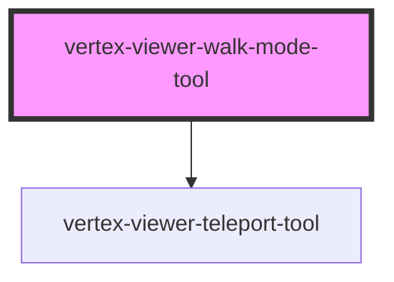

# vertex-viewer-walk-mode-tool

<!-- Auto Generated Below -->

## Overview

The `<vertex-viewer-walk-mode-tool>` allows for additional interactions
intended for walking through a model instead of orbiting a model.

## Properties

| Property       | Attribute       | Description                                                                                                                                                                                                                                                                                                                                                                                                                                                                                                                                                                                                                                                                                                                                                                      | Type                                                                   | Default               |
| -------------- | --------------- | -------------------------------------------------------------------------------------------------------------------------------------------------------------------------------------------------------------------------------------------------------------------------------------------------------------------------------------------------------------------------------------------------------------------------------------------------------------------------------------------------------------------------------------------------------------------------------------------------------------------------------------------------------------------------------------------------------------------------------------------------------------------------------- | ---------------------------------------------------------------------- | --------------------- |
| `controller`   | --              | The `WalkModeController` responsible for controlling `KeyBinding`s and excluded elements, as well as updating the `WalkModeModel` with various configuration settings.                                                                                                                                                                                                                                                                                                                                                                                                                                                                                                                                                                                                           | `WalkModeController \| undefined`                                      | `undefined`           |
| `enabled`      | `enabled`       | Determines whether the interaction handlers for this tool should respond to events. When set to `true`, the default viewer interaction mode will be overridden to use the `pivot` camera interaction type, keyboard controls for movement will be added, and setting the `teleportMode` will enable the tool.  Defaults to `true`.                                                                                                                                                                                                                                                                                                                                                                                                                                               | `boolean`                                                              | `true`                |
| `model`        | --              | The `WalkModeModel` responsible for tracking configuration and emitting events for interaction handlers to respond to.                                                                                                                                                                                                                                                                                                                                                                                                                                                                                                                                                                                                                                                           | `WalkModeModel`                                                        | `new WalkModeModel()` |
| `teleportMode` | `teleport-mode` | The type of teleportation to perform when clicking. This value is passed through to a `<vertex-viewer-teleport-tool>`'s mode attribute.  `teleport` - the camera's `position` is moved to the location of the hit result constrained by the plane represented by the camera's current `position` and `up` vectors.  `teleport-and-align` - the camera's `position`, `lookAt`, and `up` vectors are updated to align to the plane represented by the hit result's position and normal.  `teleport-toward` - the camera's `position` is moved a fixed distance toward the location of the hit result constrained by the plane represented by the camera's current `position` and `up` vectors.  `undefined` - no teleportation will occur when clicking.  Defaults to `undefined`. | `"teleport" \| "teleport-and-align" \| "teleport-toward" \| undefined` | `undefined`           |
| `viewer`       | --              | The viewer that this component is bound to. This is automatically assigned if added to the light-dom of a parent viewer element.                                                                                                                                                                                                                                                                                                                                                                                                                                                                                                                                                                                                                                                 | `HTMLVertexViewerElement \| undefined`                                 | `undefined`           |

## Events

| Event               | Description                                                                    | Type                              |
| ------------------- | ------------------------------------------------------------------------------ | --------------------------------- |
| `controllerChanged` | Event emitted when the `WalkModeController` associated with this tool changes. | `CustomEvent<WalkModeController>` |

## Dependencies

### Depends on

- [vertex-viewer-teleport-tool](../viewer-teleport-tool)

### Graph

----------------------------------------------

*Built with [StencilJS](https://stenciljs.com/)*
