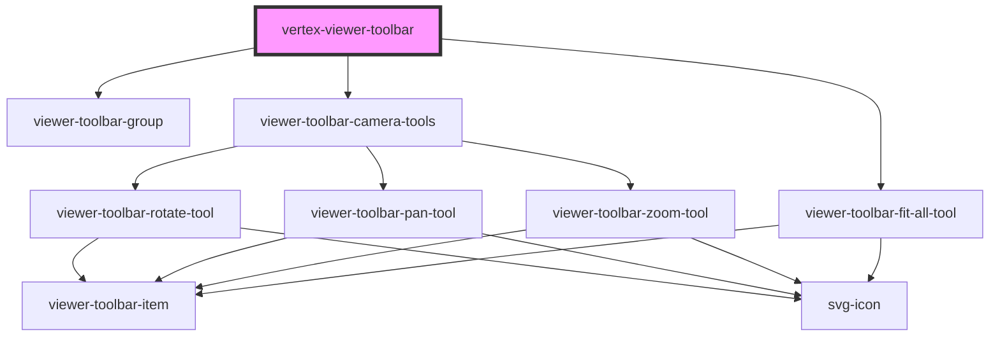

# vertex-viewer-toolbar

The `vertex-viewer-toolbar` element provides a wrapper around the children provided to it that
will position the children at the bottom of the `vertex-viewer` element. By default, this element will
render in the `viewer-toolbar-camera-tools` element, which contains a set of default interaction tools.

## Style Overrides

| Variable Name                             | Description                                                                         | Default |
| ----------------------------------------- | ----------------------------------------------------------------------------------- | ------- |
| `--vertex-viewer-toolbar-width`           | The width that the toolbar should take in the containing element                    | `100%`  |
| `--vertex-viewer-toolbar-left-position`   | The horizontal position of the toolbar from the left side of the containing element | `0`     |
| `--vertex-viewer-toolbar-bottom-position` | The vertical position of the toolbar from the bottom of the containing component    | `16px`  |

<!-- Auto Generated Below -->

## Properties

| Property | Attribute | Description                                                                                                                                                                                 | Type                      | Default     |
| -------- | --------- | ------------------------------------------------------------------------------------------------------------------------------------------------------------------------------------------- | ------------------------- | ----------- |
| `viewer` | --        | The `vertex-viewer` component that this toolbar will interact with. This property can be injected by the `vertex-viewer` when a `data-viewer="{{viewer element id}}"` attribute is present. | `HTMLVertexViewerElement` | `undefined` |

## Dependencies

### Depends on

- [viewer-toolbar-group](../viewer-toolbar-group)
- [viewer-toolbar-camera-tools](../viewer-toolbar-camera-tools)
- [viewer-toolbar-fit-all-tool](../viewer-toolbar-fit-all-tool)

### Graph

----------------------------------------------

*Built with [StencilJS](https://stenciljs.com/)*
